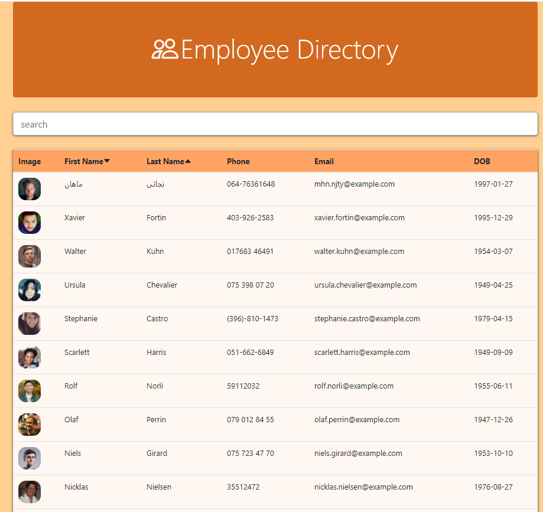

# React Employee Directory
  
  
  ## Descriptions

  This application utilizes an api to similuate a database of employees. This application outputs a table displaying all employees in the company. The search bar allows users to search for any employee by first name or last name ignoring case sensativity. The user is also able to organize the table alphabetically or in reverse by either an employee's first or last name. The search is done automatically as the user starts typing.

  ## Table of Contents

  * [Installation](#installation)
  * [Usage](#usage)
  * [License](#license)
  * [Credits](#contributing)
  * [Tests](#tests)
  * [Questions](#questions)
    
  ## Installation
  
  The user must install axios, boostrap, react, react-dom, and react-scripts.
  
  ## Usage

  

  ## License

  This application is covered by the Creative Commons license.

  ## Contributing

  There were no collaborators for this project.

  ## Tests

  There are no tests for this project.

  ## Questions

  If you have any questions please send an email to: ldelgadothethird@gmail.com or go to github at: https://github.com/ldelgadoIII

